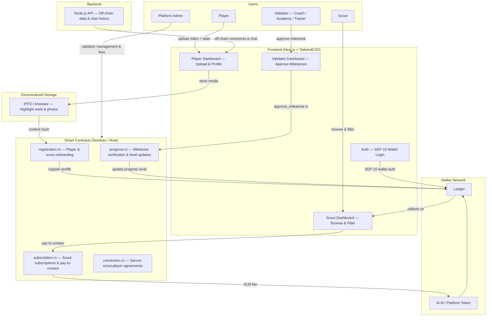
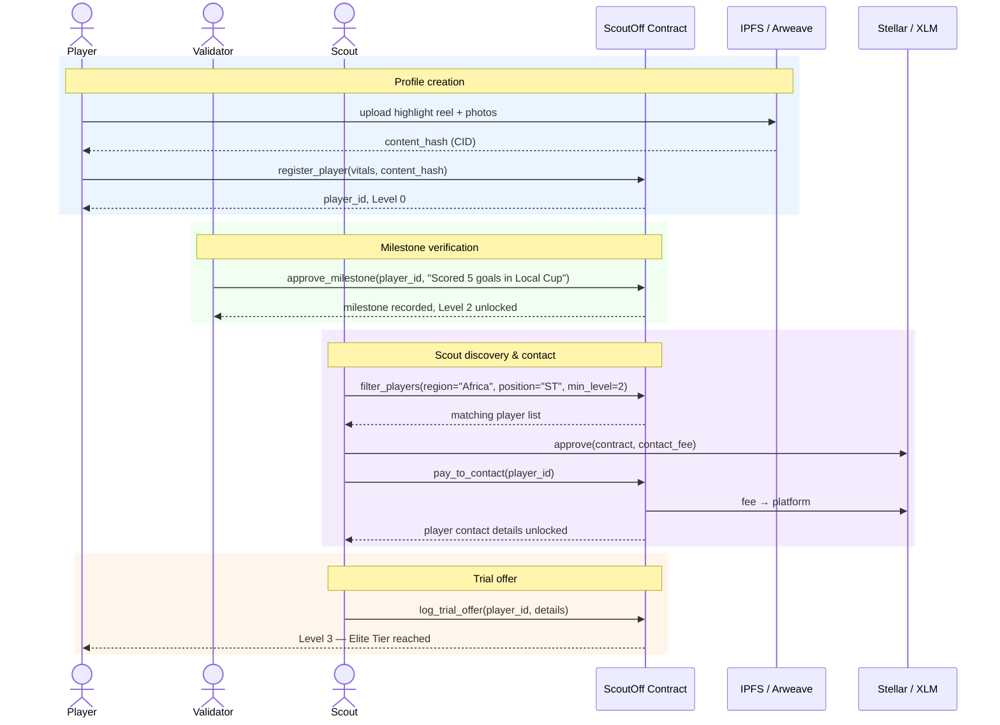

# ScoutOff

[](https://github.com/your-org/scout-off-frontend/actions/workflows/ci.yml)

Decentralized football scouting platform on Stellar with tamper-proof player profiles, on-chain milestone verification, and direct scout-to-player connections via Soroban smart contracts.

## Overview

ScoutOff addresses the visibility gap for talented players in underserved regions by creating trusted, searchable player profiles backed by verified milestones. Players build dynamic on-chain profiles with milestones verified by coaches, academy directors, and certified trainers—giving scouts confidence to invest in a flight or trial.

Stellar enables frictionless payments: transactions cost fractions of a cent and settle in 3–5 seconds, so scouts can pay players globally without banking fees. Soroban smart contracts manage player registration, progress verification, and scout subscriptions with complete on-chain auditability.

## Features

- **Dynamic Player Profiles**: On-chain identity with vitals (age, position, location), highlight reels on IPFS/Arweave, and verified stats
- **Verifiable Progress**: Milestones written to the blockchain by approved validators (coaches, academies, certified trainers)
- **Tamper-Proof History**: Scouts can view the complete on-chain audit trail of a player's progress
- **Scout Filtering**: Filter players by region, position, and verified progress tier
- **Pay-to-Contact**: Scouts pay micro-fees in XLM to unlock player contact details
- **Scout Subscriptions**: On-chain subscriptions gate access and prevent spam
- **Wallet Authentication**: Secure login via SEP-10 with Freighter, Albedo, or Lobstr
- **Fractionalized Sponsorship** _(Future)_: Fans and investors buy "Player Tokens" to fund training and travel, with revenue routed back on-chain

## Architecture



### Core Components

- **registration.rs**: Player and scout onboarding; stores wallet address, verification level, and IPFS hashes
- **progress.rs**: Processes validator-approved milestones and updates a player's progress level
- **subscription.rs**: Manages scout subscriptions and pay-to-contact payments in XLM
- **connection.rs**: Manages scout-to-player connection agreements
- **storage.rs**: Persistent storage for profiles, milestones, and subscriptions
- **events.rs**: Event emission for off-chain indexing and monitoring

### Progress Level Model

| Level | Name                   | Trigger                                        |
| ----- | ---------------------- | ---------------------------------------------- |
| 0     | Unverified             | Player registers and uploads initial data      |
| 1     | Verified Identity      | KYC passed or academy confirms club membership |
| 2     | Performance Milestones | Performance verified by an approved validator  |
| 3     | Elite Tier             | Scout logs trial offer on-chain                |

## Tech Stack

| Layer             | Technology               | Purpose                                                                |
| ----------------- | ------------------------ | ---------------------------------------------------------------------- |
| Smart Contracts   | Rust + Soroban (Stellar) | Player registration, progress verification, subscriptions, connections |
| Frontend          | Next.js 14 + TailwindCSS | Player dashboard and scout discovery interface                         |
| Backend & Storage | Node.js + IPFS           | Media storage; IPFS hashes stored on-chain in player profiles          |
| Auth              | Stellar SEP-10           | Wallet login via Freighter, Albedo, or Lobstr                          |
| Payments          | XLM                      | Micro-fee pay-to-contact and scout subscriptions                       |

## Project Structure

```
scout-off-frontend/
├── app/                          # Next.js 14 App Router
│   ├── layout.tsx                # Root layout — WalletProvider + Navbar
│   ├── page.tsx                  # Landing page
│   ├── globals.css               # Tailwind base + .input component class
│   ├── player/
│   │   ├── page.tsx              # ✅ Player dashboard (register / view milestones)
│   │   └── [id]/page.tsx         # ✅ Public player profile + pay-to-contact
│   ├── scout/
│   │   ├── page.tsx              # ✅ Scout dashboard (filter + player grid)
│   │   ├── subscribe/            # 🔲 Scout subscription flow
│   │   └── [id]/                 # 🔲 Scout public profile
│   ├── validator/                # 🔲 Validator dashboard (approve milestones)
│   └── api/
│       └── ipfs/upload/route.ts  # ✅ Server-side Pinata proxy
│
├── components/
│   ├── Navbar.tsx                # ✅
│   ├── WalletButton.tsx          # ✅
│   ├── ProgressBar.tsx           # ✅
│   ├── PlayerCard.tsx            # ✅
│   ├── ui/                       # 🔲 Shared primitives (Modal, Toast, Badge)
│   ├── player/                   # 🔲 Player-specific components (MilestoneList, VideoUpload)
│   ├── scout/                    # 🔲 Scout-specific components (ContactModal, SubscriptionCard)
│   └── validator/                # 🔲 Validator-specific components (ApproveForm)
│
├── context/
│   └── WalletContext.tsx         # ✅ Shared wallet state + session restore
│
├── hooks/
│   ├── useWallet.ts              # ✅ Re-exports useWalletContext
│   ├── usePlayer.ts              # ✅ Fetch player from contract
│   └── useScout.ts               # ✅ filter_players contract call
│
├── lib/
│   ├── stellar.ts                # ✅ SorobanRpc client + network constants
│   ├── contract.ts               # ✅ Typed contract wrappers (read/write split)
│   ├── ipfs.ts                   # ✅ uploadToIPFS + ipfsUrl helpers
│   └── api.ts                    # ✅ Axios client for backend REST API
│
├── types/
│   └── index.ts                  # ✅ Player, Scout, Milestone, ProgressLevel, PlayerFilter
│
├── __tests__/
│   ├── components/               # 🔲 Component tests
│   ├── hooks/                    # 🔲 Hook tests
│   └── lib/                      # 🔲 Contract + API util tests
│
├── scripts/
│   └── validate-env.js           # ✅ Checks all env vars are in .env.example
│
├── public/
│   └── icons/                    # 🔲 App icons / PWA assets
│
├── .github/
│   └── workflows/
│       └── ci.yml                # ✅ Lint + test + env validation on push/PR
│
├── .env.example                  # ✅
├── next.config.js                # ✅
├── tailwind.config.ts            # ✅
├── tsconfig.json                 # ✅
└── package.json                  # ✅
```

> ✅ Implemented · 🔲 Folder created, implementation pending

## Smart Contract Functions

### Player Functions

- `register_player(wallet, vitals, ipfs_hash)` — Create a new player profile with IPFS media
- `update_profile(player_id, ipfs_hash)` — Update profile media (player auth required)

### Validator Functions

- `approve_milestone(player_id, milestone, validator)` — Write a verified milestone and advance level (validator auth required)
- `revoke_milestone(player_id, milestone_id)` — Revoke a milestone (admin or validator auth required)

### Scout Functions

- `subscribe(scout, tier)` — Purchase a scout subscription in XLM (scout auth required)
- `pay_to_contact(scout, player_id)` — Unlock player contact details (scout auth required)
- `log_trial_offer(scout, player_id, details)` — Record a trial offer on-chain and advance player to Level 3

### Admin Functions

- `initialize(admin, platform_token, fee_config)` — One-time contract setup
- `add_validator(validator_address)` — Authorize a new validator (admin only)
- `remove_validator(validator_address)` — Revoke validator authorization (admin only)
- `withdraw_fees(to)` — Withdraw accumulated platform fees (admin only)
- `pause_contract()` / `unpause_contract()` — Emergency pause (admin only)

### Query Functions

- `get_player(player_id)` — Full profile, milestone history, and current progress level
- `get_milestone_history(player_id)` — Ordered list of all on-chain milestones with timestamps
- `get_validators()` — List of currently authorized validators
- `get_subscription(scout)` — Scout's active subscription tier and expiry
- `filter_players(region, position, min_level)` — Query players by region, position, and progress level
- `health()` — On-chain health check

## Player Progress Flow — Sequence Diagram



## Player Progress — State Machine

```
┌─────────────────┐
│    Level 0      │  ← initial state (profile created, data uploaded)
│   Unverified    │
└────────┬────────┘
         │  KYC or academy confirmation
         ▼
┌─────────────────┐
│    Level 1      │
│    Verified     │
│    Identity     │
└────────┬────────┘
         │  Validator approves performance milestone
         ▼
┌─────────────────┐
│    Level 2      │
│   Performance   │
│   Milestones    │
└────────┬────────┘
         │  Scout logs trial offer
         ▼
┌─────────────────┐
│    Level 3      │  ← Elite Tier (highest level)
│   Elite Tier    │
└─────────────────┘
```

### Valid Transitions

| From    | To      | Trigger                                                       |
| ------- | ------- | ------------------------------------------------------------- |
| Level 0 | Level 1 | Academy or KYC confirms active club membership                |
| Level 1 | Level 2 | Approved validator writes a verified performance milestone    |
| Level 2 | Level 3 | Scout calls `log_trial_offer` — trial offer recorded on-chain |

## Security Features

1. **Validator Authorization**: Only admin-approved validators can write milestones
2. **Tamper-Proof History**: All milestone timestamps and validator identities are immutably recorded on Soroban
3. **Authorization Checks**: All state-changing operations require proper Stellar account authorization
4. **Overflow Protection**: Safe arithmetic throughout all fee and subscription calculations
5. **Anti-Spam Gating**: Scout subscriptions and pay-to-contact fees prevent fraudulent contact attempts
6. **Circuit Breaker**: Admin can pause the contract in an emergency without losing state
7. **Server-Side IPFS Proxy**: Pinata API keys never exposed to the client

## Quick Start

### 1. Install Dependencies

```bash
npm install
```

### 2. Build Smart Contracts

```bash
cd ../scout-off-contracts
cargo build --target wasm32-unknown-unknown --release
stellar contract optimize --wasm target/wasm32-unknown-unknown/release/scout_off.wasm
```

### 3. Deploy to Testnet

```bash
stellar contract deploy \
  --wasm target/wasm32-unknown-unknown/release/scout_off.optimized.wasm \
  --source deployer \
  --network testnet
```

### 4. Initialize Contract

```bash
stellar contract invoke \
  --id <CONTRACT_ID> \
  --source deployer \
  --network testnet \
  -- initialize \
  --admin <ADMIN_ADDRESS> \
  --platform_token <TOKEN_ADDRESS> \
  --fee_config <FEE_CONFIG>
```

### 5. Run the Frontend

```bash
cp .env.example .env.local
# fill in CONTRACT_ID, PINATA_API_KEY, NEXT_PUBLIC_API_URL, etc.
npm run dev
```

See [DEPLOYMENT.md](DEPLOYMENT.md) for complete deployment instructions.

## How It Works

1. **Player Onboarding** — Connect wallet → upload highlights to IPFS → call `register_player` → profile created at Level 0
2. **Milestone Verification** — Validator approves milestone → calls `approve_milestone` → player progress advances
3. **Scout Discovery** — Scout subscribes or pays per contact → filters by region/position/level → views full history
4. **Trial & Elite Tier** — Scout calls `log_trial_offer` → player advances to Level 3
5. **Admin / Validator Management** — Admin authorizes validators, monitors fees, and manages contract state

## Environment Validation

Verifies all environment variables are declared in `.env.example`. Runs automatically in CI.

```bash
node scripts/validate-env.js
```

## Configuration

### Quick Setup

```bash
cp .env.example .env.local
```

### Key Configuration Variables

| Variable                   | Description                                        |
| -------------------------- | -------------------------------------------------- |
| `NEXT_PUBLIC_CONTRACT_ID`  | Deployed ScoutOff contract address                 |
| `NEXT_PUBLIC_NETWORK`      | `testnet` or `mainnet`                             |
| `NEXT_PUBLIC_HORIZON_URL`  | Stellar Horizon endpoint                           |
| `NEXT_PUBLIC_SOROBAN_RPC`  | Soroban RPC endpoint                               |
| `PINATA_API_KEY`           | Pinata API key for IPFS uploads (server-side only) |
| `PINATA_SECRET`            | Pinata secret (server-side only)                   |
| `NEXT_PUBLIC_IPFS_GATEWAY` | IPFS gateway for serving media                     |
| `NEXT_PUBLIC_API_URL`      | Backend API base URL (default: localhost:4000)     |
| `PLATFORM_CONTACT_FEE_XLM` | XLM fee for pay-to-contact (default: 1)            |

## Testing

```bash
# Frontend tests
npm run test

# Validate env vars
node scripts/validate-env.js

# Smart contract tests (in scout-off-contracts repo)
cd ../scout-off-contracts && cargo test
```

Test coverage targets:

- ✅ Player registration and profile storage
- ✅ Milestone approval and progress level advancement
- ✅ Scout subscription and pay-to-contact fee handling
- ✅ Trial offer logging and Level 3 transition
- ✅ Validator authorization enforcement
- ✅ Fee accumulation and admin withdrawal
- ✅ Pause / unpause circuit breaker
- ✅ Edge cases: unauthorized validators, duplicate milestones, invalid fees

## Implementation Status

| Area                | Status      | Notes                                         |
| ------------------- | ----------- | --------------------------------------------- |
| Config & tooling    | ✅ Complete | package.json, tsconfig, tailwind, CI          |
| Types               | ✅ Complete | Player, Scout, Milestone, ProgressLevel       |
| Lib layer           | ✅ Complete | stellar, contract, ipfs, api clients          |
| Wallet context      | ✅ Complete | Shared state, session restore on mount        |
| Shared components   | ✅ Complete | Navbar, WalletButton, ProgressBar, PlayerCard |
| Player dashboard    | ✅ Complete | Register + milestone history                  |
| Player profile page | ✅ Complete | Public view + pay-to-contact                  |
| Scout dashboard     | ✅ Complete | Filter form + player grid                     |
| Validator dashboard | 🔲 Pending  | `app/validator/` folder created               |
| Scout subscription  | 🔲 Pending  | `app/scout/subscribe/` folder created         |
| Trial offer UI      | 🔲 Pending  | Extends scout profile page                    |
| UI primitives       | 🔲 Pending  | `components/ui/` folder created               |
| Chat component      | 🔲 Pending  | `components/scout/` folder created            |
| Frontend tests      | 🔲 Pending  | `__tests__/` folders created                  |
| PWA / icons         | 🔲 Pending  | `public/icons/` folder created                |

## Roadmap

- [x] Player profile registration on Stellar Testnet
- [x] Validator milestone approval and on-chain progress updates
- [x] Scout filtering by region, position, and progress tier
- [ ] Pay-to-contact and subscription model in XLM
- [ ] Trial offer logging (Level 3 Elite Tier)
- [ ] Validator dashboard
- [ ] Fractionalized Player Token sponsorship
- [ ] Mobile-optimized PWA for low-bandwidth regions
- [ ] Mainnet launch

## Dependencies

- `soroban-sdk = "25.3.1"` — Soroban smart contract SDK
- `next = "14.2.3"` — React framework
- `@stellar/stellar-sdk = "12.1.0"` — Stellar JS SDK
- `@stellar/freighter-api = "2.0.0"` — Freighter wallet integration (SEP-10)
- `axios = "1.7.2"` — HTTP client for backend API

## Error Codes

| Code | Error                 | Description                            | Common Cause                      | Resolution                         |
| ---- | --------------------- | -------------------------------------- | --------------------------------- | ---------------------------------- |
| 1    | AlreadyInitialized    | Contract already initialized           | Calling `initialize` twice        | No action needed                   |
| 2    | NotInitialized        | Contract not initialized               | Operations before setup           | Call `initialize` first            |
| 3    | PlayerNotFound        | Player ID does not exist               | Invalid or unregistered player_id | Verify player_id from registration |
| 4    | UnauthorizedValidator | Caller is not an approved validator    | Non-validator calling approve     | Admin must call `add_validator`    |
| 5    | InvalidMilestone      | Milestone data is empty or malformed   | Missing description or hash       | Provide valid milestone data       |
| 6    | AlreadyAtLevel        | Player already at this level           | Duplicate milestone approval      | Check level via `get_player`       |
| 7    | InsufficientFee       | XLM fee too low                        | Underpaying the required fee      | Check fee via `filter_players`     |
| 8    | SubscriptionExpired   | Scout subscription has lapsed          | Accessing after expiry            | Renew via `subscribe`              |
| 9    | ContractPaused        | Contract is paused                     | Circuit breaker active            | Wait for admin to unpause          |
| 10   | Unauthorized          | Caller is not authorized               | Wrong Stellar account             | Use correct account                |
| 11   | NoFeesToWithdraw      | No accumulated platform fees           | Withdrawal before payments        | Wait for fees to accumulate        |
| 12   | Overflow              | Arithmetic overflow in fee calculation | Extremely large XLM amount        | Use safe i128 range                |

## Events

| Event                | Emitted When                                          |
| -------------------- | ----------------------------------------------------- |
| `player_registered`  | Player creates a new on-chain profile                 |
| `milestone_approved` | Validator writes a verified milestone, level advances |
| `milestone_revoked`  | Validator or admin removes an erroneous milestone     |
| `scout_subscribed`   | Scout purchases a subscription tier                   |
| `player_contacted`   | Scout pays to unlock player contact details           |
| `trial_offer_logged` | Scout records a trial offer, player reaches Level 3   |
| `fees_withdrawn`     | Admin withdraws accumulated platform fees             |

## License

MIT

## Support

- [GitHub Issues](https://github.com/your-org/scout-off-frontend/issues)
- [Stellar Discord](https://discord.gg/stellar)
- [Stellar Developers](https://developers.stellar.org)

## Contributing

Contributions are welcome! Please see [CONTRIBUTING.md](CONTRIBUTING.md) for guidelines.

Quick checklist for contributions:

- Frontend tests pass: `npm run test`
- Env validation passes: `node scripts/validate-env.js`
- Contract tests pass: `cd ../scout-off-contracts && cargo test`
- New features include tests and documentation
- Milestone and fee logic changes require explicit review
