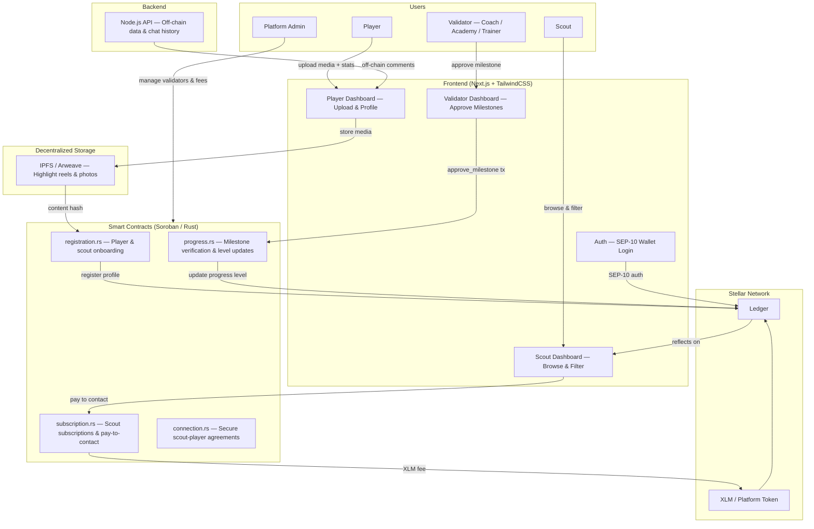
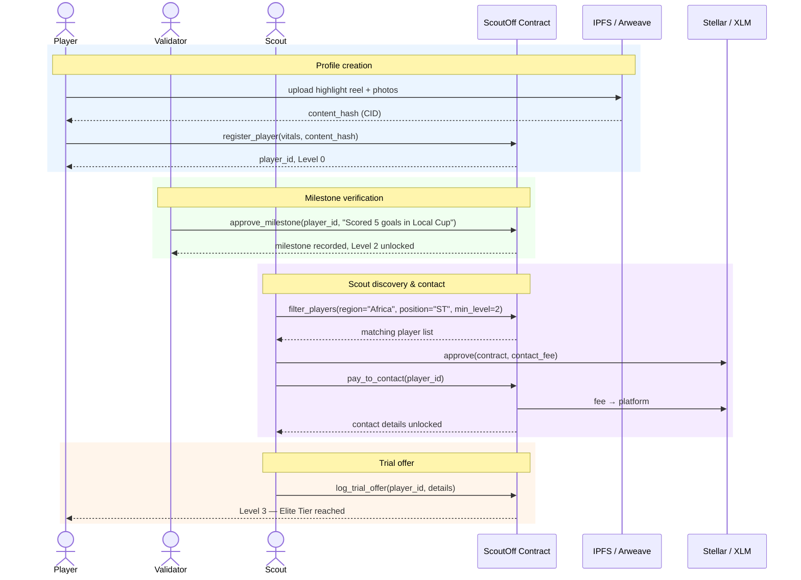

# ScoutOff

[](https://github.com/scout-off/scout-off-frontend/actions/workflows/ci.yml) [](https://codecov.io/gh/scout-off/scout-off-frontend)

> Trustworthy football scouting for underserved regions, built on Stellar and Soroban with IPFS-backed player identity.

**ScoutOff connects players, scouts, validators, and admins with on-chain profiles, verified milestones, and frictionless XLM access.**

---

## Quick links

- [Getting started](#getting-started)
- [What is ScoutOff](#what-is-scoutoff)
- [Why it matters](#why-it-matters)
- [Architecture](#architecture)
- [Smart contract functions](#smart-contract-functions)
- [Progress model](#progress-model)
- [Security](#security)
- [Testing & validation](#testing--validation)
- [Roadmap](#roadmap)
- [Contributing](#contributing)

---

## Implementation notes

These documents contain implementation detail that is still actively relevant but lives at the repo root rather than under `docs/`. If you are working in the areas they cover, read them first.

| Document                                               | Covers                                                                                                                                                                                                                                                           |
| ------------------------------------------------------ | ---------------------------------------------------------------------------------------------------------------------------------------------------------------------------------------------------------------------------------------------------------------- |
| [ICON_GUIDE.md](ICON_GUIDE.md)                         | How the PWA icon system is structured — asset locations, design specs, all PNG generation methods (Node script, Inkscape, ImageMagick), manifest integration, and a production deployment checklist.                                                             |
| [ICONS_IMPLEMENTATION.md](ICONS_IMPLEMENTATION.md)     | Issue #115 implementation summary — records exactly which files were created or modified, what the SVG branding design contains, and the step-by-step process for regenerating PNGs if `icon.svg` ever changes.                                                  |
| [SWAHILI_IMPLEMENTATION.md](SWAHILI_IMPLEMENTATION.md) | Verification report for the Swahili (`sw`) locale rollout — covers what was added to `messages/sw.json`, how the locale is wired into routing and middleware, and which translation strings are still marked for native-speaker review.                          |
| [TRIAL_OFFER_STRUCTURE.md](TRIAL_OFFER_STRUCTURE.md)   | Full reference for the `log_trial_offer` contract call — the `TrialOffer` TypeScript interface, how `details` should be serialized as a JSON string, how to encode it with `nativeToScVal`, and the `useTrialOffer` hook pattern that mirrors `usePayToContact`. |

### Architecture decisions

See [docs/adr/README.md](docs/adr/README.md) for the project’s architecture decision records and the ADR index.

---

## What is ScoutOff

ScoutOff is a decentralized football scouting platform that empowers talented players in underserved regions. It combines on-chain player profiles, validator-approved milestones, and pay-to-contact gating to create a trusted discovery marketplace.

## Why it matters

- **Unearth hidden talent** from regions that lack established scouting networks.
- **Protect scouts** with tamper-resistant progress history and verified achievements.
- **Enable fair access** through low-cost XLM payments and subscription controls.
- **Improve confidence** for scouts, coaches, and players with transparent on-chain records.

## Highlights

- **Player profiles on-chain** with IPFS-backed highlights and verified metadata.
- **Validator-approved progress** from coaches, academies, and certified trainers.
- **Scout discovery** by region, position, and progress level.
- **Pay-to-contact gating** for controlled introductions.
- **Admin tooling** for validators, fees, and emergency pause.
- **Multilingual UI** in English, French, and Swahili.

## Features

- **Dynamic player identity**: on-chain vitals, location, position, verified stats, and IPFS media.
- **Verified milestone workflow**: approved validators write performance milestones to Soroban.
- **Tamper-proof audit trail**: every progress update is recorded immutably.
- **Scout search & filters**: find players by region, role, and verification tier.
- **Pay-to-contact**: XLM micro-fees unlock direct player contact information.
- **Scout subscriptions**: recurring access controls reduce spam and gate discovery.
- **SEP-10 wallet auth**: secure login using Freighter, Albedo, or Lobstr.
- **Sponsorship vision**: future fractionalized player token funding for travel and training.

## Architecture


```mermaid
graph TB
    subgraph Users
        P[Player]
        V[Validator — Coach / Academy / Trainer]
        S[Scout]
        ADM[Platform Admin]
    end

    subgraph Frontend["Frontend (Next.js + TailwindCSS)"]
        PD[Player Dashboard — Upload & Profile]
        SD[Scout Dashboard — Browse & Filter]
        VD[Validator Dashboard — Approve Milestones]
        AUTH[Auth — SEP-10 Wallet Login]
    end

    subgraph Contract["Smart Contracts (Soroban / Rust)"]
        REG[registration.rs — Player & scout onboarding]
        PROG[progress.rs — Milestone verification & level updates]
        SUB[subscription.rs — Scout subscriptions & pay-to-contact]
        CONN[connection.rs — Secure scout-player agreements]
    end

    subgraph Storage["Decentralized Storage"]
        IPFS[IPFS / Arweave — Highlight reels & photos]
    end

    subgraph Backend["Backend"]
        NODE[Node.js API — Off-chain data & chat history]
    end

    subgraph Stellar["Stellar Network"]
        LEDGER[Ledger]
        XLM[XLM / Platform Token]
    end

    P -->|upload media + stats| PD
    PD -->|store media| IPFS
    IPFS -->|content hash| REG
    REG -->|register profile| LEDGER

    V -->|approve milestone| VD
    VD -->|approve_milestone tx| PROG
    PROG -->|update progress level| LEDGER
    LEDGER -->|reflects on| SD

    S -->|browse & filter| SD
    SD -->|pay to contact| SUB
    SUB -->|XLM fee| XLM
    XLM --> LEDGER

    AUTH -->|SEP-10 auth| LEDGER
    NODE -->|off-chain comments| PD
    ADM -->|manage validators & fees| Contract
```

### Core components

- `registration.rs` — player and scout onboarding, wallet binding, and IPFS hash storage.
- `progress.rs` — validator milestone approval and progress level updates.
- `subscription.rs` — scout subscriptions and pay-to-contact payments in XLM.
- `connection.rs` — secure scout-player agreements and trial offer metadata.
- `storage.rs` — persistent profile, milestone, and subscription state.
- `events.rs` — event emission for off-chain indexing and monitoring.

## Tech stack

| Layer             | Technology               | Purpose                                                                |
| ----------------- | ------------------------ | ---------------------------------------------------------------------- |
| Smart Contracts   | Rust + Soroban (Stellar) | Player registration, progress verification, subscriptions, connections |
| Frontend          | Next.js 14 + TailwindCSS | Player dashboard, scout discovery, validator/admin workflows           |
| Backend & Storage | Node.js + IPFS           | Media upload, gateway proxy, and persistent content references         |
| Auth              | Stellar SEP-10           | Wallet login via Freighter, Albedo, or Lobstr                          |
| Payments          | XLM                      | Scout subscriptions, pay-to-contact, and platform fee routing          |

## Project structure

```text
scout-off-frontend/
├── app/                          # Next.js App Router
│   ├── layout.tsx                # Root layout — WalletProvider + Navbar
│   ├── globals.css               # Tailwind base styles + component utilities
│   ├── error.tsx                 # Global error boundary page
│   ├── not-found.tsx             # 404 page
│   ├── [locale]/                 # i18n routing (en, fr, sw)
│   │   ├── layout.tsx            # Locale layout with next-intl
│   │   ├── page.tsx              # Localized landing page
│   │   ├── player/               # Player dashboard and public profile
│   │   ├── scout/                # Scout dashboard, subscribe flow, public page
│   │   ├── validator/            # Validator dashboard shell
│   │   └── admin/                # Admin panel
│   └── api/                     # Server endpoints for IPFS, auth, session, CSP
├── components/                   # Shared UI components and widgets
├── context/                      # Wallet and auth state
├── hooks/                        # Reusable contract/UI hooks
├── lib/                          # Stellar, contract, IPFS, API, and utility helpers
├── types/                        # Shared TypeScript interfaces
├── messages/                     # i18n translation files
├── packages/indexer/             # Off-chain event indexing service
├── __tests__/                    # Component, hook, and lib tests
├── scripts/                      # Env validation and dev utilities
├── public/                       # Static assets and PWA manifest
├── .github/                      # CI workflows, PR templates, and docs
├── .env.example                  # Environment variable template
├── next.config.js                # Next.js configuration
├── tailwind.config.ts            # Tailwind configuration
├── tsconfig.json                 # TypeScript configuration
└── package.json                  # Dependencies and scripts
```

## Smart contract functions

### Player

- `register_player(wallet, vitals, ipfs_hash)` — create a player profile with on-chain metadata and IPFS media.
- `update_profile(player_id, ipfs_hash)` — refresh profile media (player authorization required).

### Validator

- `approve_milestone(player_id, milestone, validator)` — record a verified milestone and advance progress.
- `revoke_milestone(player_id, milestone_id)` — revoke a milestone (admin or validator authorization required).

### Scout

- `subscribe(scout, tier)` — purchase a scout subscription tier in XLM.
- `pay_to_contact(scout, player_id)` — unlock player contact details after a micro-fee.
- `log_trial_offer(scout, player_id, details)` — record a trial offer and advance the player to Elite Tier.

### Admin

- `initialize(admin, platform_token, fee_config)` — one-time contract bootstrap.
- `add_validator(validator_address)` — authorize a validator.
- `remove_validator(validator_address)` — revoke a validator.
- `withdraw_fees(to)` — withdraw accumulated platform fees.
- `pause_contract()` / `unpause_contract()` — emergency pause controls.

### Queries

- `get_player(player_id)` — full player profile, milestone history, and progress level.
- `get_milestone_history(player_id)` — ordered on-chain milestone history.
- `get_validators()` — active validator list.
- `get_subscription(scout)` — current scout tier and expiry.
- `filter_players(region, position, min_level)` — discover players by filters.
- `health()` — contract health check.

## Progress model


```mermaid
sequenceDiagram
    actor Player
    actor Validator
    actor Scout
    participant Contract as ScoutOff Contract
    participant IPFS as IPFS / Arweave
    participant XLM as Stellar / XLM

    rect rgb(235, 245, 255)
        Note over Player,IPFS: Profile creation
        Player->>IPFS: upload highlight reel + photos
        IPFS-->>Player: content_hash (CID)
        Player->>Contract: register_player(vitals, content_hash)
        Contract-->>Player: player_id, Level 0
    end

    rect rgb(240, 255, 240)
        Note over Validator,Contract: Milestone verification
        Validator->>Contract: approve_milestone(player_id, "Scored 5 goals in Local Cup")
        Contract-->>Validator: milestone recorded, Level 2 unlocked
    end

    rect rgb(245, 235, 255)
        Note over Scout,Contract: Scout discovery & contact
        Scout->>Contract: filter_players(region="Africa", position="ST", min_level=2)
        Contract-->>Scout: matching player list
        Scout->>XLM: approve(contract, contact_fee)
        Scout->>Contract: pay_to_contact(player_id)
        Contract->>XLM: fee → platform
        Contract-->>Scout: contact details unlocked
    end

    rect rgb(255, 245, 235)
        Note over Scout,Contract: Trial offer
        Scout->>Contract: log_trial_offer(player_id, details)
        Contract-->>Player: Level 3 — Elite Tier reached
    end
```

## Progress levels

| Level | Name              | Entry condition                         |
| ----: | ----------------- | --------------------------------------- |
|     0 | Unverified        | Profile created with initial data       |
|     1 | Verified Identity | KYC or academy confirms club membership |
|     2 | Performance       | Validator-approved milestone logged     |
|     3 | Elite Tier        | Scout logs a trial offer                |

### Transitions

| From    | To      | Trigger                                                    |
| ------- | ------- | ---------------------------------------------------------- |
| Level 0 | Level 1 | Academy or KYC confirms active club membership             |
| Level 1 | Level 2 | Approved validator writes a verified performance milestone |
| Level 2 | Level 3 | Scout logs `log_trial_offer` and advances the player       |

## Security

- **Validator authorization** restricts milestone writes to approved validators.
- **Immutable audit trail** stores progress history and timestamps on-chain.
- **Strict authorization checks** secure every state-changing action.
- **Safe arithmetic** protects fee and subscription logic.
- **Anti-spam gating** uses subscriptions and pay-to-contact fees.
- **Circuit breaker** allows admins to pause contract activity on incident.
- **Server-side IPFS proxy** keeps Pinata keys off the client.

### Vulnerability Disclosure

ScoutOff follows responsible disclosure practices. If you discover a security vulnerability, please report it through our [Security Advisory](https://github.com/scout-off/scout-off-frontend/security/advisories/new) page or check our [security policy](SECURITY.md) and [security.txt](public/.well-known/security.txt) for more information.

## Getting started

> For full local development with contracts and backend, see [DEVELOPMENT.md](DEVELOPMENT.md).

### 1. Install dependencies

If you use [nvm](https://github.com/nvm-sh/nvm), run `nvm use` in the project root first to switch to the pinned Node version (see `.nvmrc`). If you don't have that version installed, run `nvm install` instead. See [DEVELOPMENT.md](DEVELOPMENT.md) for full setup details.

```bash
nvm use        # or: nvm install
npm install
```

### 2. Build smart contracts

```bash
cd ../scout-off-contracts
cargo build --target wasm32-unknown-unknown --release
stellar contract optimize --wasm target/wasm32-unknown-unknown/release/scout_off.wasm
```

### 3. Deploy to Testnet

```bash
stellar contract deploy \
  --wasm target/wasm32-unknown-unknown/release/scout_off.optimized.wasm \
  --source deployer \
  --network testnet
```

### 4. Initialize the contract

```bash
stellar contract invoke \
  --id <CONTRACT_ID> \
  --source deployer \
  --network testnet \
  -- initialize \
  --admin <ADMIN_ADDRESS> \
  --platform_token <TOKEN_ADDRESS> \
  --fee_config <FEE_CONFIG>
```

### 5. Run the frontend

```bash
cp .env.example .env.local
# fill in contract and API values
npm run dev
```

## Testing & validation

```bash
npm run test
node scripts/validate-env.js
cd ../scout-off-contracts && cargo test
```

### Recommended validation

- ✅ Frontend tests pass
- ✅ Environment validation passes
- ✅ Contract integration tests pass for on-chain changes
- ✅ No secrets or credentials are committed
- ✅ Documentation is updated for new or changed behavior

## Configuration

### Quick setup

```bash
cp .env.example .env.local
```

### Key environment variables

| Variable                   | Description                                        |
| -------------------------- | -------------------------------------------------- |
| `NEXT_PUBLIC_CONTRACT_ID`  | Deployed ScoutOff contract address                 |
| `NEXT_PUBLIC_NETWORK`      | `testnet` or `mainnet`                             |
| `NEXT_PUBLIC_HORIZON_URL`  | Stellar Horizon endpoint                           |
| `NEXT_PUBLIC_SOROBAN_RPC`  | Soroban RPC endpoint                               |
| `PINATA_API_KEY`           | Pinata API key for IPFS uploads (server-side only) |
| `PINATA_SECRET`            | Pinata secret (server-side only)                   |
| `NEXT_PUBLIC_IPFS_GATEWAY` | IPFS gateway for serving media                     |
| `NEXT_PUBLIC_API_URL`      | Backend API base URL (default: localhost:4000)     |
| `PLATFORM_CONTACT_FEE_XLM` | XLM fee for pay-to-contact (default: 1)            |

## Testing

```bash
# Frontend tests
npm run test

# Frontend tests in watch mode
npm run test:watch

# Frontend tests with coverage
npm run test:coverage

# Type checking
npm run typecheck
npm run type-check    # Standalone CI job, excludes test files

# Validate env vars
node scripts/validate-env.js

# Smart contract tests (in scout-off-contracts repo)
cd ../scout-off-contracts && cargo test
```

Test coverage targets:

- ✅ Player registration and profile storage
- ✅ Milestone approval and progress level advancement
- ✅ Scout subscription and pay-to-contact fee handling
- ✅ Trial offer logging and Level 3 transition
- ✅ Validator authorization enforcement
- ✅ Fee accumulation and admin withdrawal
- ✅ Pause / unpause circuit breaker
- ✅ Edge cases: unauthorized validators, duplicate milestones, invalid fees

## Implementation Status

| Area                 | Status      | Notes                                                                                                                                                                  |
| -------------------- | ----------- | ---------------------------------------------------------------------------------------------------------------------------------------------------------------------- | --- | ------------------- | ----------- | ---------------------------------------------------------------------------------------- |
| Config & tooling     | ✅ Complete | package.json, tsconfig, tailwind, CI, Husky, lint-staged                                                                                                               |
| Types                | ✅ Complete | Player, Scout, Milestone, ValidatorInfo, Subscription, Contact                                                                                                         |
| Lib layer            | ✅ Complete | stellar, contract, ipfs, api, sanitize, regions, positions                                                                                                             |
| Wallet context       | ✅ Complete | Freighter / Albedo / LOBSTR, SEP-10, balance, session restore                                                                                                          |
| Shared components    | ✅ Complete | Navbar, WalletButton, ProgressBar, PlayerCard, Skeleton                                                                                                                |
| UI primitives        | ✅ Complete | Modal, Toast, Badge, Button, Spinner, Select, Tooltip, ErrorBoundary                                                                                                   |
| Player components    | ✅ Complete | PlayerProfileForm, UpdateProfileForm, MilestoneTimeline, IPFSMediaGallery                                                                                              |
| Player dashboard     | ✅ Complete | Register + milestone history                                                                                                                                           |
| Player profile page  | ✅ Complete | Public view + pay-to-contact                                                                                                                                           |
| Scout dashboard      | ✅ Complete | Filter form + wallet search + paginated player grid                                                                                                                    |
| Scout subscription   | ✅ Complete | Tier selection + XLM payment via `useSubscription`                                                                                                                     |
| Validator components | ✅ Complete | ApproveForm, RevokeForm, ValidatorPlayerSearch                                                                                                                         |     | Validator dashboard | ✅ Complete | ValidatorPlayerSearch + ApproveForm + RevokeForm + ApprovedPlayersRoster wired with i18n |
| Admin panel          | ✅ Complete | Add/remove validators, withdraw fees, pause/unpause                                                                                                                    |
| Hooks                | ✅ Complete | usePlayer, useScout, useValidator, useSubscription, usePayToContact, useMilestoneHistory, useIPFSUpload, useContractHealth, useIsPaused, useDebounce, useRequireWallet |
| Off-chain indexer    | ✅ Complete | IndexerMetrics with tests in `packages/indexer/`                                                                                                                       |
| Frontend tests       | ✅ Complete | Component, hook, lib, and page-level tests (see `__tests__/`); `scripts/validate-env.js` runs in CI                                                                    |
| i18n                 | ✅ Complete | English, French, Swahili via next-intl; validator and admin dashboards fully translated                                                                                |
| Scout public profile | ✅ Complete | `app/[locale]/scout/[id]/page.tsx` renders ScoutProfileCard + ActivityFeed with EmptyState fallback                                                                    |
| Scout ContactModal   | ✅ Complete | `components/scout/ContactModal.tsx` displays unlocked email/phone/telegram                                                                                             |
| Trial offer UI       | ✅ Complete | `components/scout/TrialOfferForm.tsx` wired into `app/[locale]/player/[id]/page.tsx` for `log_trial_offer`                                                             |
| PWA raster icons     | ✅ Complete | 16/32/192/512 + maskable 512 PNGs in `public/icons/`, all entries in `manifest.json` resolve                                                                           |

## Roadmap

- Player profile registration on Stellar Testnet
- Validator milestone approval and on-chain progress updates
- Scout filtering by region, position, and progress tier
- Scout subscription flow (tier selection + XLM payment)
- Admin panel (validator management, fees, circuit breaker)
- i18n — English, French, Swahili
- SEP-10 wallet auth (Freighter, Albedo, LOBSTR)
- Fractionalized player token sponsorship
- Mobile-optimized PWA for low-bandwidth regions
- Mainnet launch

## Dependencies

- `soroban-sdk = "25.3.1"` — Soroban smart contract SDK
- `next = "14.2.3"` — React framework
- `@stellar/stellar-sdk = "12.1.0"` — Stellar JS SDK
- `@stellar/freighter-api = "2.0.0"` — Freighter wallet integration (SEP-10)
- `axios = "1.7.2"` — HTTP client for backend API

## Support

- [GitHub Issues](https://github.com/your-org/scout-off-frontend/issues)
- [Stellar Discord](https://discord.gg/stellar)
- [Stellar Developers](https://developers.stellar.org)

## Contributing

Contributions are welcome! Please see [CONTRIBUTING.md](CONTRIBUTING.md) for guidelines.
